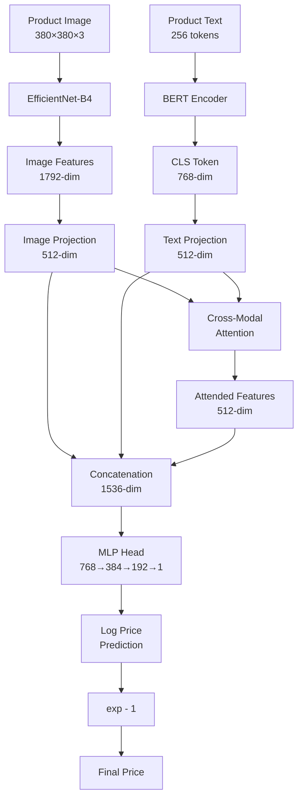

# Dual-Encoder Price Prediction Pipeline

## Pipeline Overview

This is a **multimodal machine learning system** that predicts product prices by jointly processing:
1. **Product images** (via EfficientNet-B4)
2. **Product descriptions** (via BERT)

The system combines visual and textual features through cross-modal attention to make price predictions.

---

## 1. Data Preprocessing

### Image Augmentation
For training images, random transformations are applied:
- **Resize**: All images → 380×380 pixels
- **Random horizontal flip**: p=0.5
- **Random rotation**: ±15°
- **Color jitter**: brightness, contrast, saturation adjustments
- **Normalization**: 

```
I_norm = (I - μ) / σ
where μ = [0.485, 0.456, 0.406], σ = [0.229, 0.224, 0.225] (ImageNet stats)
```

### Text Processing
- **Tokenization**: Text → token IDs using BERT tokenizer
- **Max length**: 256 tokens (truncated/padded)
- **Output**: `input_ids` and `attention_mask`

### Target Transformation
Prices are log-transformed to handle skewed distribution:

```
y_log = log(1 + price)
```

This stabilizes variance and makes optimization easier.

---

## 2. Model Architecture

### A. Image Encoder (EfficientNet-B4)

EfficientNet uses compound scaling and inverted residual blocks (MBConv).

**Key operations:**

```
x_img ∈ ℝ^(B×3×380×380) → EfficientNet-B4 → f_img ∈ ℝ^(B×1792)
```

Where:
- B = batch size
- 1792 = feature dimension of EfficientNet-B4

**MBConv block formula:**

```
x' = x + F(x; W)
F(x) = PWConv(DWConv(PWConv(x)))
```

- PWConv: 1×1 pointwise convolution (channel expansion/reduction)
- DWConv: Depthwise convolution (spatial filtering)

### B. Text Encoder (BERT)

BERT processes text through transformer layers.

**Input embedding:**

```
E = TokenEmbed + PositionEmbed + SegmentEmbed
```

**Multi-head self-attention (in each layer):**

```
Attention(Q, K, V) = softmax(QK^T / √d_k) V

where:
Q = E·W_Q, K = E·W_K, V = E·W_V
d_k = dimension per head
```

**Output:**

```
x_text ∈ ℝ^(B×256×768) → Extract CLS token → f_text ∈ ℝ^(B×768)
```

### C. Projection Layers

Both modalities are projected to a common 512-dimensional space:

**Image projection:**

```
p_img = ReLU(LayerNorm(f_img · W_img + b_img))
p_img ∈ ℝ^(B×512)
```

**Text projection:**

```
p_text = ReLU(LayerNorm(f_text · W_text + b_text))
p_text ∈ ℝ^(B×512)
```

Where:
- W_img ∈ ℝ^(1792×512), W_text ∈ ℝ^(768×512)
- LayerNorm: mean=0, variance=1 normalization
- Dropout applied after each projection

---

## 3. Cross-Modal Attention

This allows the image representation to attend to text features.

**Multi-head attention formula:**

```
p_img' = p_img.unsqueeze(1)  # ℝ^(B×1×512)
p_text' = p_text.unsqueeze(1)  # ℝ^(B×1×512)

Attention_output = MultiHeadAttention(Query=p_img', Key=p_text', Value=p_text')
```

**Detailed computation (per head):**

```
Q_i = p_img' · W_Q^i  # Query from image
K_i = p_text' · W_K^i  # Key from text
V_i = p_text' · W_V^i  # Value from text

head_i = softmax(Q_i K_i^T / √d_k) V_i

Attention_output = Concat(head_1, ..., head_8) · W_O
```

Where:
- 8 attention heads
- d_k = 512/8 = 64 (dimension per head)

**Result:**

```
f_attended ∈ ℝ^(B×512)  # Image features enhanced by text information
```

---

## 4. Feature Fusion

All three representations are concatenated:

```
f_combined = [p_img || p_text || f_attended] ∈ ℝ^(B×1536)
```

Where `||` denotes concatenation.

---

## 5. Regression Head

Multi-layer perceptron predicts log-price:

```
h_1 = GELU(LayerNorm(f_combined · W_1 + b_1)) ∈ ℝ^(B×768)
h_1 = Dropout(h_1)

h_2 = GELU(LayerNorm(h_1 · W_2 + b_2)) ∈ ℝ^(B×384)
h_2 = Dropout(h_2)

h_3 = GELU(h_2 · W_3 + b_3) ∈ ℝ^(B×192)
h_3 = Dropout(h_3)

ŷ_log = h_3 · W_4 + b_4 ∈ ℝ^(B×1)
```

**GELU activation:**

```
GELU(x) = x · Φ(x) = x · (1/2)[1 + erf(x/√2)]
```

Where Φ is the CDF of standard normal distribution.

---

## 6. Loss Function: SMAPE

**Symmetric Mean Absolute Percentage Error:**

```
SMAPE = (1/N) Σᵢ |ŷᵢ - yᵢ| / ((|yᵢ| + |ŷᵢ|)/2 + ε) × 100%
```

**In log space (as implemented):**

```
ŷ = exp(ŷ_log) - 1  # Convert from log back to original scale
y = exp(y_log) - 1

SMAPE = (1/N) Σᵢ |ŷᵢ - yᵢ| / ((|yᵢ| + |ŷᵢ|)/2 + ε)
```

Where:
- ε = 1e-8 (numerical stability)
- ŷ = predicted price
- y = actual price

**Properties:**
- Symmetric (treats over/under-prediction equally)
- Scale-independent (percentage-based)
- Bounded between 0% and 200%

---

## 7. Training Strategy

### Warmup Phase (Epochs 0-3)

```
∇_θ_encoder = 0  # Freeze encoders
Update only: {projection, attention, fusion head}
```

### Fine-tuning Phase (Epochs 4+)

```
Update all parameters with different learning rates:
- Image encoder: lr = 1e-4
- Text encoder: lr = 2e-5  (smaller, pre-trained)
- Fusion components: lr = 1e-3
```

### Gradient Clipping

```
if ||∇θ|| > max_norm:
    ∇θ ← (max_norm / ||∇θ||) · ∇θ
```

Where max_norm = 1.0

### Mixed Precision Training

Computations in float16, accumulation in float32:

```
loss_scaled = loss × scale_factor
∇θ = ∇loss_scaled / scale_factor
```

---

## 8. Inference Pipeline

**Test-time prediction:**

```
1. Load image → Transform → f_img
2. Tokenize text → f_text
3. Forward pass → ŷ_log
4. Convert: ŷ = exp(ŷ_log) - 1
5. Clip: ŷ = max(ŷ, 0.01)  # Ensure positive prices
```

---

## Key Innovations

1. **Dual-encoder architecture**: Processes modalities separately before fusion
2. **Cross-modal attention**: Allows semantic alignment between vision and language
3. **Multi-scale features**: EfficientNet captures hierarchical visual patterns
4. **Contextual text understanding**: BERT captures long-range semantic dependencies
5. **Log-space optimization**: Stabilizes training for wide price ranges
6. **Warmup strategy**: Prevents catastrophic forgetting of pre-trained weights

---

## Mathematical Dimensions Summary

```
Image:     ℝ^(B×3×380×380) → ℝ^(B×1792) → ℝ^(B×512)
Text:      ℝ^(B×256) → ℝ^(B×256×768) → ℝ^(B×768) → ℝ^(B×512)
Attention: ℝ^(B×512) ⊗ ℝ^(B×512) → ℝ^(B×512)
Fusion:    ℝ^(B×1536) → ℝ^(B×768) → ℝ^(B×384) → ℝ^(B×192) → ℝ^(B×1)
```

---

## Complete Forward Pass Flow



---

## Hyperparameters Summary

| Parameter | Value | Purpose |
|-----------|-------|---------|
| Image Size | 380×380 | Input resolution |
| Batch Size | 35 | Memory-compute tradeoff |
| Max Text Length | 256 | Capture detailed descriptions |
| Warmup Epochs | 4 | Stabilize fusion layers |
| Total Epochs | 15 | Full training duration |
| Image LR | 1e-4 | EfficientNet learning rate |
| Text LR | 2e-5 | BERT learning rate (smaller) |
| Head LR | 1e-3 | Fusion components LR |
| Dropout | 0.35 | Regularization |
| Weight Decay | 1e-4 | L2 regularization |
| Patience | 8 | Early stopping threshold |

---

## Architecture Advantages

1. **Complementary Information**: Vision captures aesthetics, brand, quality; text captures specifications, features
2. **Cross-Modal Reasoning**: Attention mechanism aligns visual and textual semantics
3. **Robust to Missing Data**: Can make predictions even if one modality is weak
4. **Transfer Learning**: Leverages pre-trained models (EfficientNet on ImageNet, BERT on text corpora)
5. **End-to-End Training**: All components jointly optimized for price prediction

This architecture effectively combines complementary information from images and text to make robust price predictions!
